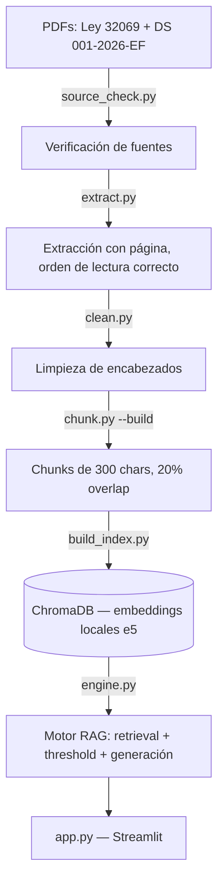
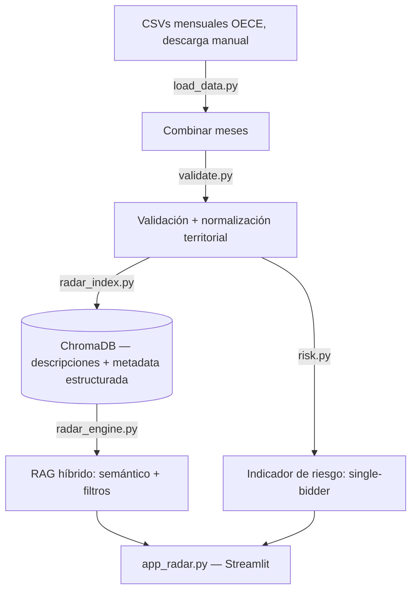

# RAG Normativo + RAG Radar — Contrataciones Públicas del Perú

Dos herramientas para una MYPE que quiere vender al Estado:

- **Tarea 1 (RAG Normativo)** — Asistente que responde preguntas sobre la
  Ley N.° 32069 (Ley General de Contrataciones Públicas) y el Decreto
  Supremo N.° 001-2026-EF (que modifica su Reglamento), citando siempre
  documento y página, y absteniéndose cuando la pregunta está fuera del
  corpus indexado.
- **Tarea 2 (RAG Radar)** — Explora qué compra el Estado y dónde,
  combinando datos abiertos de OECE con búsqueda semántica + filtros
  estructurados (departamento, monto, categoría), más un indicador de
  riesgo (procesos con un solo postor).

Decisiones de arquitectura, sustituciones de proveedor y hallazgos
técnicos documentados con evidencia en **[DECISIONES.md](DECISIONES.md)**.

## Estado del proyecto

| | Fase | Estado |
|---|---|---|
| Tarea 1 | 1. Fuentes, extracción, limpieza | ✅ |
| Tarea 1 | 2. Chunking, embeddings, índice | ✅ |
| Tarea 1 | 3. Motor RAG (threshold, versiones) | ✅ |
| Tarea 1 | 4. Evaluación + comparación embeddings | ✅ |
| Tarea 1 | 5. Streamlit | ✅ |
| Tarea 2 | 1. Descarga de datos OECE | ✅ |
| Tarea 2 | 2. Validación y normalización | ✅ script listo |
| Tarea 2 | 3. RAG híbrido | ✅ script listo |
| Tarea 2 | 4. Dashboard Streamlit | ✅ script listo (mapa = bar chart, ver nota) |
| Tarea 2 | 5. Indicador de riesgo | ✅ script listo |

## Requisitos

- Python 3.10+, Windows 10/11.
- Cuenta gratuita (sin tarjeta): [Cohere](https://dashboard.cohere.com/api-keys)
  (generación + embeddings de comparación). Ver [DECISIONES.md](DECISIONES.md)
  para el historial de por qué se usa Cohere en vez de OpenAI/Gemini.

## Instalación (Windows)

```powershell
git clone <tu-repo>
cd HW_03_202602_InteractiveProject
python -m venv venv
venv\Scripts\activate
Set-ExecutionPolicy -Scope CurrentUser -ExecutionPolicy RemoteSigned   # solo si PowerShell bloquea la activación

copy .env.example .env
# Abre .env y agrega: COHERE_API_KEY=tu-key-de-cohere
```

## Tarea 1 — RAG Normativo

### Pipeline



### Ejecución (offline, una sola vez tras cambiar los PDFs)

```powershell
cd tarea1_rag_normativo
pip install -r requirements.txt

python src\source_check.py
python src\extract.py
python src\clean.py
python src\chunk.py --build
python src\build_index.py
```

### Ejecución (online, cada vez que quieras usarlo)

```powershell
streamlit run app.py --server.fileWatcherType none
```

### Resultados clave (evidencia completa en `logs/` y `DECISIONES.md`)

- **Threshold calibrado**: 0.70 (sweep completo en `logs/threshold_sweep.csv`)
- **Recall@k** (a nivel de documento, 15 preguntas in-domain): 67% / 87% / 93% (k=1,3,5)
- **Abstention rate**: 93.3% in-domain correcto, 80% out-of-domain correcto
- **Embeddings — local vs. API** (`logs/embeddings_comparison.csv`):

  | | Local (multilingual-e5-base) | API (Cohere embed-multilingual-v3.0) |
  |---|---|---|
  | Dimensión | 768 | 1024 |
  | Latencia/consulta | 27ms | 198ms |
  | Recall@1/3/5 | 67%/93%/93% | 67%/93%/93% |
  | Costo | $0 | $0 |

  Se usa el modelo **local** en producción (mismo Recall, 7x más rápido).

### Modelo generador

**Cohere `command-r-08-2024`** (gratis, nivel trial). Se probaron y
descartaron OpenAI (requiere créditos de pago) y Gemini (bug confirmado
de Google con API keys nuevas — ver DECISIONES.md).

## Tarea 2 — RAG Radar

### Pipeline



### Ejecución

```powershell
cd tarea2_radar
pip install pandas chromadb pyyaml python-dotenv cohere sentence-transformers streamlit

# 1. Descargar manualmente 3+ meses de 2026 de:
#    https://contratacionesabiertas.oece.gob.pe/descargas
#    (vienen en .zip — descomprimir y ubicar el .csv de procesos)
#    Guardar en data\raw\ como oece_2026_01.csv, oece_2026_02.csv, oece_2026_03.csv

python src\load_data.py
# Si falla por columnas: ajustar COLUMN_MAP en src\validate.py y N_BIDDERS_COL en src\risk.py
python src\validate.py
python src\risk.py
python src\radar_index.py

streamlit run app_radar.py --server.fileWatcherType none
```

**Nota sobre el "mapa"**: por restricción de tiempo, la vista geográfica
usa un gráfico de barras por departamento en `app_radar.py`
(`choropleth_placeholder()`), no un choropleth real — eso requiere un
GeoJSON de los departamentos del Perú que no está incluido. Documentado
como limitación conocida.

## Estructura del repositorio

```
├── README.md                  (este archivo)
├── DECISIONES.md               # decisiones + sustituciones de proveedor, con evidencia
├── .env.example
├── tarea1_rag_normativo/
│   ├── config.yaml
│   ├── requirements.txt
│   ├── app.py                  # Streamlit
│   ├── src/                    # extracción, limpieza, chunking, embeddings, engine
│   ├── eval/                   # preguntas.csv, eval_recall.py, compare_embeddings.py
│   ├── data/{raw,processed,index}/
│   └── logs/                   # toda la evidencia (reportes, sweeps, comparaciones)
└── tarea2_radar/
    ├── config.yaml
    ├── app_radar.py             # Streamlit
    ├── src/                     # load_data, validate, risk, radar_index, radar_engine
    ├── data/{raw,processed,outputs,index}/
    └── logs/
```

## Costos reales

Todo el proyecto corre con proveedores **gratuitos** (Cohere trial +
modelo de embeddings local). Log de costos real en
`tarea1_rag_normativo/logs/cost_log.csv` y
`tarea2_radar/logs/cost_log.csv` — costo acumulado: **$0.00**.


# HW-03 Interactive Project

## Tarea 1 - RAG normativo

Sistema de recuperación y generación basado en embeddings
y documentación normativa.

## Tarea 2 - Radar de procesos

Extensión del proyecto para búsqueda de procesos de contratación
pública y detección de señales mediante reglas explicables.

## Relación entre ambas tareas

La Tarea 2 reutiliza componentes desarrollados en la Tarea 1,
particularmente el backend de embeddings y su configuración.

## Flujo general

Usuario
→ búsqueda híbrida
→ recuperación de procesos
→ señales del radar
→ resultados explicables
